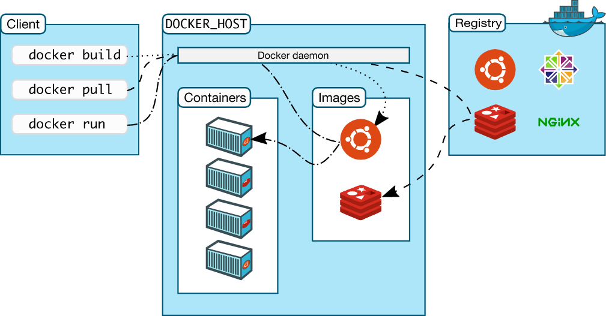

# Docker指南

## 概念
### 官网解释
Docker 是一个用于开发、发布和运行应用程序的开放平台。**Docker 提供了在称为容器的松散隔离环境中打包和运行应用程序的能力**。隔离和安全性**允许您在给定主机上同时运行多个容器**。**容器是轻量级的**，包含运行应用程序所需的一切，因此您**无需依赖主机**上当前安装的内容。您可以在工作时轻松共享容器，并确保与您共享的每个人都获得以相同方式工作的同一个容器。**Docker 还提供工具和平台来管理容器的生命周期**。
准备就绪后，**将应用程序部署到生产环境中，作为容器或编排的服务。这样无论您的生产环境是本地数据中心、云提供商还是两者的混合，这都是一样的**。

### 通俗翻译
Docker 是运行在计算机或服务器上的“虚拟机”式容器，每个容器都是**独立隔离**的环境，不会因为宿主机是 Mac OS 或 Windows 或 Linux 而被影响。作用就是将软件打包成**标准化单元**，以用于开发、交付和部署。

## 为什么要用Docker
### 1. 更高效的利用系统资源
Docker容器不需要进行硬件虚拟及完整运行操作系统的额外开销，所以资源利用率更高。无论是应用执行速度、内存损耗还是IO速度，都要比传统虚拟机更高效。因此，相比传统虚拟机技术，同一台计算机往往能运行更多的应用。
### 2. 更快速的启动时间
Docker启动可以做到秒级甚至毫秒级，极大程度减少了开发测试运维时间。
### 3. 一致的运行环境
开发过程中一个常见的问题是环境问题，例如你是用Windows开发java，部署在测试服务器上时是CentOS，线上环境又有可能是Ubuntu，使用的环境变量、JDK小版本可能也有区别无法保证。而Docker的镜像提供了除内核外完整的运行时环境，确保了运行环境一致性，不会在出现“我在开发环境试着没问题啊”这样的话。
### 4. 持续交付和部署
开发可以通过Dockerfile进行镜像构建，并结合持续集成（CI）系统进行集成测试，运维可以在生产环境中使用镜像快速部署，甚至结合持续部署（CD）系统进行自动部署。
总结一句话：一次创建或配置，在任何地方都可以正常运行。

## Docker架构
Docker 使用C/S(client/server)架构。Docker客户端与 Docker守护进程对话，后者负责构建、运行和分发 Docker 容器的繁重工作。Docker 客户端和守护程序可以 在同一系统上运行，或者我们可以将 Docker 客户端连接到远程 Docker 守护程序。Docker 客户端和守护程序使用 REST API，通过 UNIX 套接字或网络接口进行通信。另一个 Docker 客户端是 Docker Compose，它允许我们使用由一组容器组成的应用程序。

### Docker daemon（守护进程）
Docker 守护程序 ( dockerd) 侦听 Docker API 请求并管理 Docker 对象，例如图像、容器、网络和卷。守护进程还可以与其他守护进程通信以管理 Docker 服务。

### Docker Client（客户端）
Docker 客户端 ( docker) 是许多 Docker 用户与 Docker 交互的主要方式。当您使用诸如docker run之类的命令时，客户端会将这些命令发送到dockerd执行它们。该docker命令使用 Docker API。Docker 客户端可以与多个守护进程通信。

### Docker Desktop（桌面程序）
Docker Desktop 是一个易于安装的应用程序，适用于您的 Mac 或 Windows 环境，使您能够构建和共享容器化应用程序和微服务。Docker Desktop 包括 Docker 守护程序 ( dockerd)、Docker 客户端 ( docker)、Docker Compose、Docker Content Trust、Kubernetes 和 Credential Helper。有关更多信息，请参阅Docker 桌面。

### Docker registries（注册表）
Docker注册表存储 Docker 映像。Docker Hub 是一个任何人都可以使用的公共注册表，并且 Docker 默认配置为在 Docker Hub 上查找图像。您甚至可以运行自己的私有注册表。

当您使用docker pullordocker run命令时，将从您配置的注册表中提取所需的图像。当您使用该docker push命令时，您的图像会被推送到您配置的注册表中。

### Docker objects（对象）
当您使用 Docker 时，您正在创建和使用图像、容器、网络、卷、插件和其他对象。本节简要概述了其中一些对象。

### Images（图片）
映像是一个只读模板，其中包含创建 Docker 容器的说明。通常，一个图像基于另一个图像，并带有一些额外的自定义。例如，您可以基于该映像构建一个映像ubuntu ，但安装 Apache Web 服务器和您的应用程序，以及使您的应用程序运行所需的配置详细信息。

您可以创建自己的图像，也可以只使用其他人创建并在注册表中发布的图像。要构建您自己的镜像，您需要使用简单的语法创建一个Dockerfile ，用于定义创建和运行镜像所需的步骤。Dockerfile 中的每条指令都会在映像中创建一个层。当您更改 Dockerfile 并重建映像时，仅重建那些已更改的层。与其他虚拟化技术相比，这是使映像如此轻量、小巧和快速的部分原因。

### Containers（容器）
容器是图像的可运行实例。您可以使用 Docker API 或 CLI 创建、启动、停止、移动或删除容器。您可以将容器连接到一个或多个网络，将存储附加到它，甚至可以根据其当前状态创建新映像。

默认情况下，一个容器与其他容器及其主机的隔离相对较好。您可以控制容器的网络、存储或其他底层子系统与其他容器或主机的隔离程度。

容器由其映像以及您在创建或启动它时提供给它的任何配置选项定义。当容器被移除时，任何未存储在持久存储中的状态更改都会消失。
