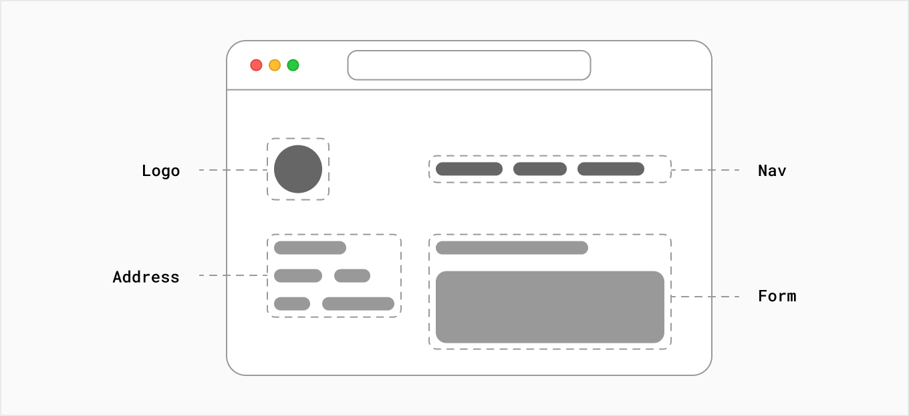
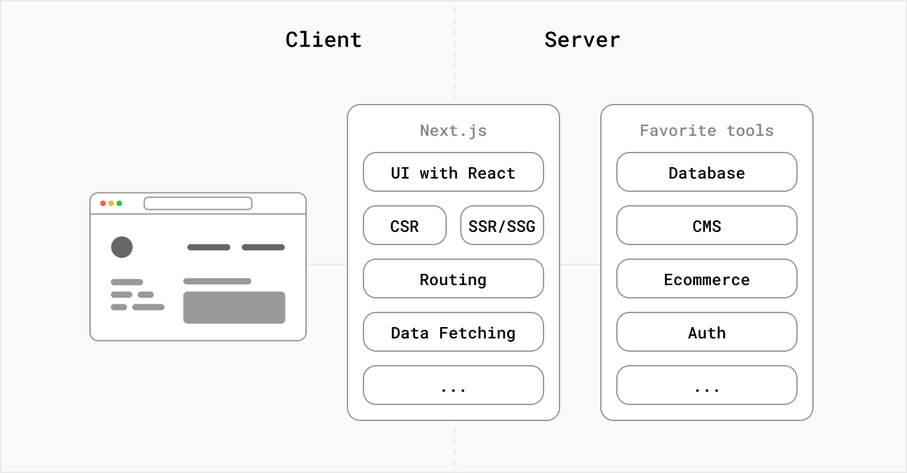

# Next.JS指南
> 本文大多翻译自官网教程，部分加入自己理解予以详细解释

## 概念
Next.js 是 Vercel 为 React 项目中可用于生产环境的开源框架，其静态混合、服务端渲染、TypeScript支持、优秀的压缩、pre-fetching的路由等特性对SEO十分友好，瞬间获得广泛好评。

## 基础知识
为了有效地使用 Next.js，熟悉 JavaScript、React 和相关的 Web 开发概念会有所帮助。
本章节的 Next.js 基础知识适合初学者，会以官网示例为主导来引导你了解 Next.js 的必备知识。你将逐步构建一个简单的项目；从 JavaScript 应用程序开始，然后将其迁移到 React 和 Next.js。 并且每个部分都建立在前一个部分的基础上。

### Next.js 是什么？
Next.js 是一个灵活的React 框架，它为您提供构建块来创建快速的 Web 应用程序。

但我们到底是什么意思呢？让我们花一些时间来扩展 React 和 Next.js 是什么以及它们如何提供帮助。

#### Web 应用程序的构建块
在构建现代应用程序时，您需要考虑一些事项。如：

- 用户界面- 用户将如何使用您的应用程序并与之交互。
- 路由- 用户如何在应用程序的不同部分之间导航。
- 数据获取- 您的数据所在的位置以及如何获取数据。
- 渲染- 何时何地渲染静态或动态内容。
- 集成- 您使用哪些第三方服务（CMS、身份验证、支付等）以及您如何连接到它们。
- 基础设施- 部署、存储和运行应用程序代码的位置（无服务器、CDN、Edge 等）。
- 性能- 如何为最终用户优化您的应用程序。
- 可扩展性——您的应用程序如何随着您的团队、数据和流量的增长而适应。
- 开发人员体验- 您的团队构建和维护您的应用程序的经验。

对于应用程序的每个部分，您需要决定是自己构建解决方案还是使用其他工具，例如库和框架。

#### 什么是React？
**React**是一个用于构建交互式**用户界面**的 JavaScript库。

**用户界面**是指用户在屏幕上看到并与之交互的元素。

通过这个JavaScript库，React 提供了有用的函数来构建 UI，然后只需要让开发人员在他们的应用程序中的指定位置使用这些函数即可。

React 成功的部分原因在于它对构建应用程序的其他方面是相对中立的，所以有了第三方工具和解决方案的蓬勃发展来的生态系统。

然而，这也意味着从头开始构建一个完整的 React 应用程序需要一些努力。开发人员需要花时间配置工具并针对常见的应用程序需求重新设计解决方案。

#### 什么是Next.js？

Next.js 是一个 React框架，它为您提供构建块来创建 Web 应用程序。

我们所说的框架是指 Next.js 处理 React 所需的工具和配置，并为您的应用程序提供额外的结构、特性和优化。

你可以使用 React 构建你的 UI，然后逐步采用 Next.js 功能来解决常见的应用程序需求，例如路由、数据获取、集成 - 同时改善开发人员和最终用户的体验。

无论你是个人开发人员还是大型团队的一员，都可以利用 React 和 Next.js 构建完全交互式、高度动态和高性能的 Web 应用程序。

### 从 JavaScript 到 React

### 从 React 到 Next.js

### Next.js是如何工作的？

### 创建 Next.js 应用程序

### 页面之间的导航

### asset/元数据/CSS

### 预渲染和数据获取

### 动态路由

### API路由

### 部署 Next.js 应用程序

### SEO（搜索引擎优化）

### TypeScript集成

## 进阶技巧
